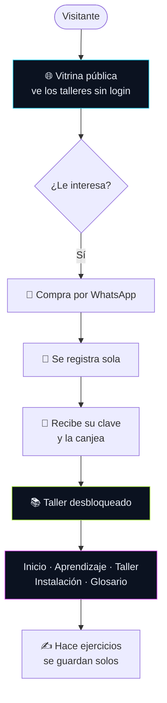
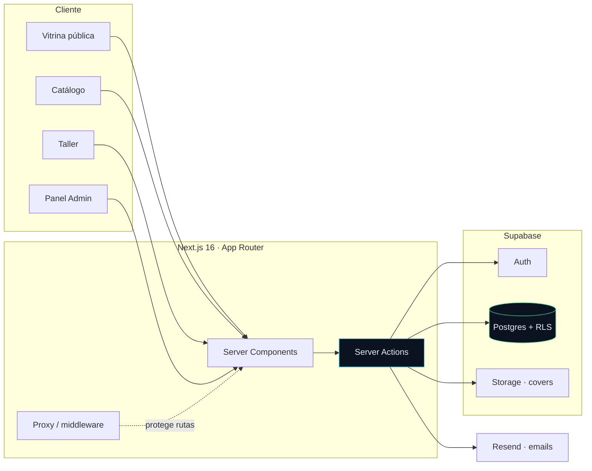
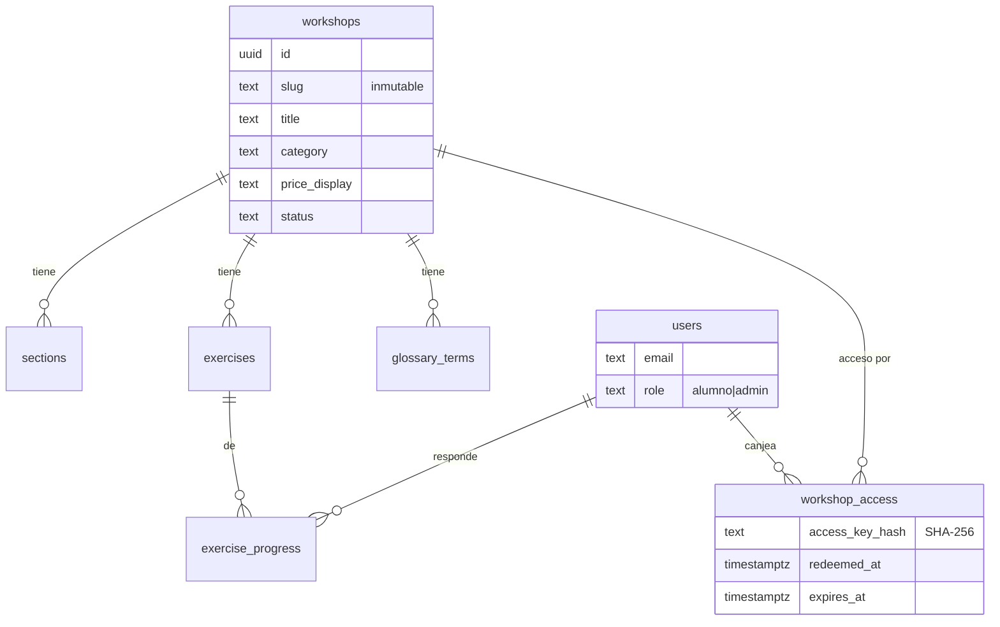

<div align="center">


# SDIH Talleres

### Portal de talleres de Salazar Duke Impact Hub

*Inteligencia con alma* — una plataforma donde el conocimiento se vende, se aprende y se practica.

<br />


**🌐 [talleres.salazardukeimpacthubteam.com](https://talleres.salazardukeimpacthubteam.com)**

</div>

---

## ✨ Qué es

Una plataforma completa de punta a punta para **publicar, vender y dictar talleres online**. Desde que una persona desconocida ve la vitrina pública, hasta que hace los ejercicios interactivos de un taller que compró — todo en un solo lugar, con su propia identidad de marca.

> 9 talleres en producción · vitrina pública · autoregistro · claves de acceso · autosave de ejercicios · panel admin completo.

---

## 🎯 Cómo funciona



**Del lado admin** (Jennifer): crea talleres, sube portadas, asigna claves a alumnas y ve todo desde un panel dedicado.

---

## 🧩 Features

| | |
|---|---|
| 🌐 **Vitrina pública** | Cualquiera ve los talleres (portada, precio, categoría) sin login |
| 📝 **Autoregistro** | Las alumnas crean su cuenta solas |
| 🔑 **Claves de acceso** | Sistema de canje con hash SHA-256; panel admin para asignarlas |
| 📚 **5 secciones por taller** | Inicio · Aprendizaje (slides) · Taller (ejercicios) · Instalación · Glosario |
| ✍️ **Autosave** | Las respuestas de los ejercicios se guardan solas con reintentos |
| 🎨 **Contenido rico** | Markdown con tablas, código copiable, videos de YouTube embebidos |
| 🗂️ **Categorías + filtros** | Chips dinámicos en catálogo y vitrina |
| 🛡️ **Seguridad auditada** | RLS en todas las tablas, security headers, contenido pago protegido a nivel DB |
| 📊 **Panel admin** | Talleres, alumnas, claves — todo con navegación fluida |

---

## 🏗️ Arquitectura



**Stack:** Next.js 16 (App Router, RSC) · React 19 · TypeScript strict · Tailwind 4 · Supabase (Auth + Postgres + Storage) · Resend · Docker + Caddy sobre VPS.

---

## 🗃️ Modelo de datos



> **RLS everywhere:** el contenido de cada taller (secciones, ejercicios, glosario) solo es visible si la alumna **canjeó** su acceso — se valida en la base de datos, no solo en la interfaz.

---

## 🚀 Desarrollo

```bash
# Requisitos: Node 22, pnpm 10.33
pnpm install
pnpm dev            # http://localhost:3000

pnpm build          # build de producción
pnpm test           # unit (Vitest)
pnpm test:e2e       # end-to-end (Playwright)
```

Variables de entorno (ver `.env.local.example`):

```
NEXT_PUBLIC_SUPABASE_URL=
NEXT_PUBLIC_SUPABASE_ANON_KEY=
SUPABASE_SERVICE_ROLE_KEY=      # server-only, nunca al cliente
RESEND_API_KEY=
NEXT_PUBLIC_WHATSAPP_NUMBER=
```

---

## 📦 Deploy

Corre en un **VPS con Docker + Caddy** (TLS y security headers automáticos):

```bash
ssh root@<vps>
cd /opt/sdih-talleres
git pull
docker compose build app && docker compose up -d
```

Las migraciones de base de datos viven en `supabase/migrations/` y se aplican manualmente en el SQL Editor de Supabase.

---

## 📂 Estructura

```
src/
├── app/
│   ├── page.tsx              → vitrina pública / router de sesión
│   ├── (auth)/               → login · registro · cambio de clave
│   ├── (authenticated)/      → catálogo · taller/[slug]
│   └── admin/                → talleres · claves · alumnas
├── components/
│   ├── catalog/              → Vitrina · CatalogView · WorkshopCard
│   ├── auth/ · admin/ · shell/
│   └── workshop/             → secciones · Markdown · ExerciseCard · VideoEmbed
└── lib/
    ├── auth/ · crypto/ · supabase/ · email/ · schemas/
docs/database/                → seeds de los 9 talleres (SQL)
supabase/migrations/          → 11 migraciones
```

---

## 🛡️ Seguridad

Auditado con lente OWASP antes de abrir a alumnas reales:

- ✅ **RLS** habilitado en las 8 tablas; contenido pago gated a nivel DB
- ✅ Claves con **hash SHA-256** + comparación timing-safe; nunca en texto plano
- ✅ **Security headers** (CSP, HSTS, X-Frame-Options) en Caddy
- ✅ `service_role` marcado `server-only` — imposible filtrarlo al bundle
- ✅ Uploads validados por **magic bytes**, no por MIME declarado

---

<div align="center">

**Salazar Duke Impact Hub** · Hecho con 🧠 e *inteligencia con alma*

</div>
